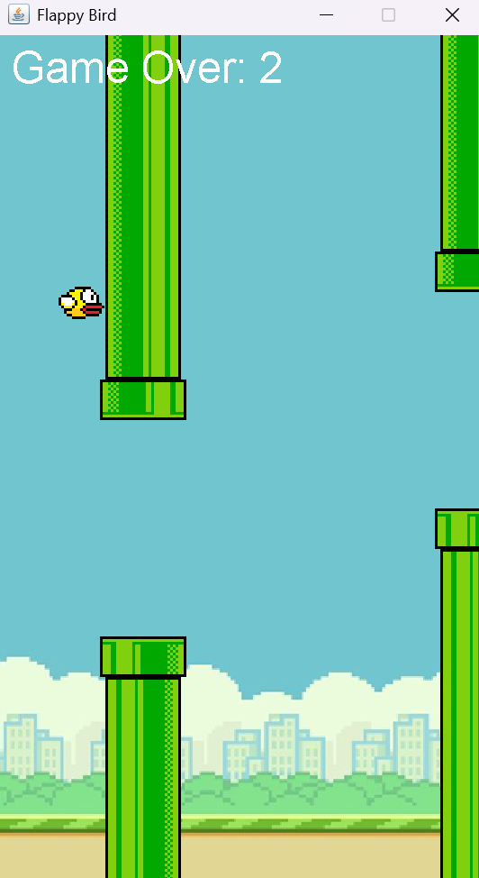

# Flappy Bird - Java Swing

A simple Flappy Bird game built using **Java**, **Swing**, and **AWT**.  
This project demonstrates basic game development concepts such as rendering graphics, handling user input, collision detection, and game loops.

---

## Features
- Bird movement controlled with the **Spacebar**  
- Gravity and jump mechanics  
- Randomly generated pipes with gaps  
- Score counter  
- Game Over screen with restart option  

---

## Getting Started

### 1. Clone the repository
```bash
git clone https://github.com/YOUR_USERNAME/FlappyBird.git
cd FlappyBird
```

### 2. Compile the code
Make sure you have **Java 8 or later** installed.  
```bash
javac -d bin src/*.java
```

### 3. Run the game
```bash
java -cp bin App
```

---

## Project Structure
```
FlappyBird/
│── src/
│   ├── App.java
│   ├── FlappyBird.java
│── bin/                # Compiled .class files (ignored in Git)
│── README.md
│── .gitignore
│── assets/ (optional - if you want to store images here)
```

---

## Screenshot



---


## Assets
- `flappybirdbg.png` → Background  
- `flappybird.png` → Bird sprite  
- `toppipe.png` → Upper pipe  
- `bottompipe.png` → Lower pipe  

⚠️ Make sure these images are placed in the correct directory (`src/` or an `assets/` folder) so they can be loaded correctly.

---

## Future Improvements
- Add background music & sound effects  
- Animated bird sprites  
- Difficulty levels (increasing pipe speed)  
- High score saving  

---

## Requirements
- Java 8 or later  
- Works on Windows, macOS, and Linux  

---

### Author
Made with ❤️ in Java  
